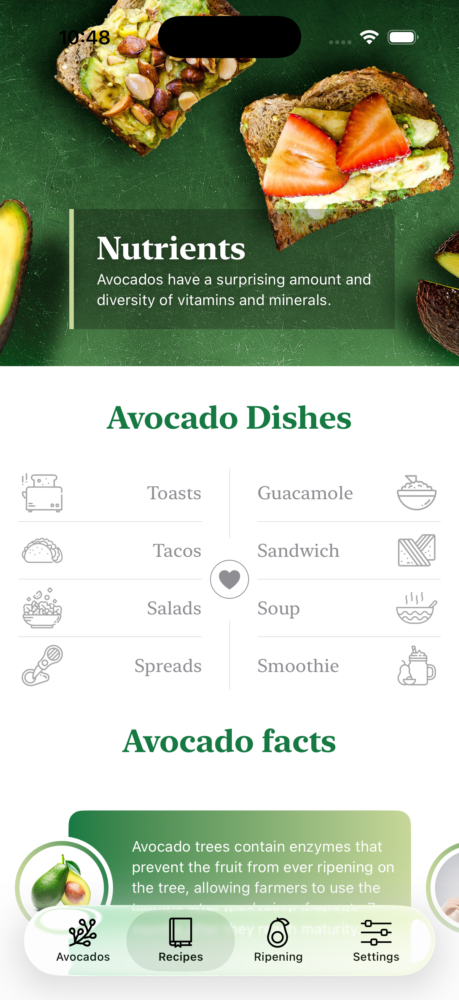
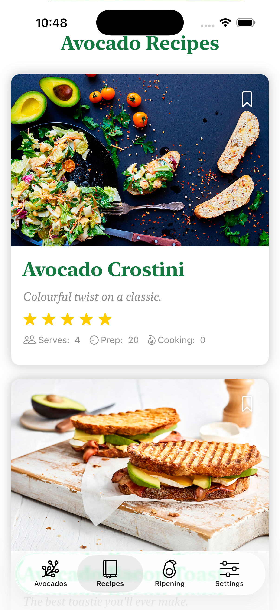
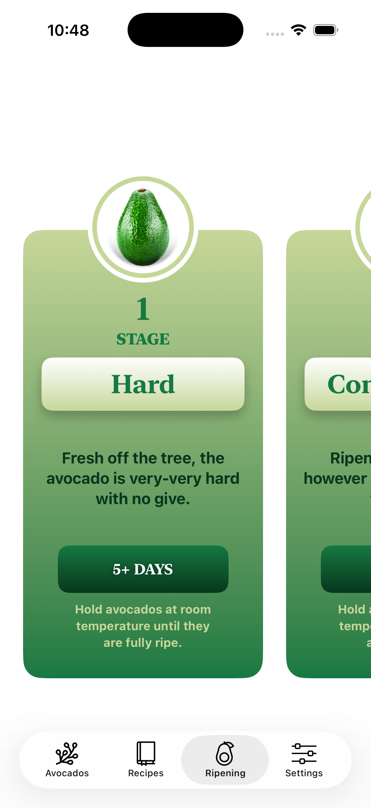
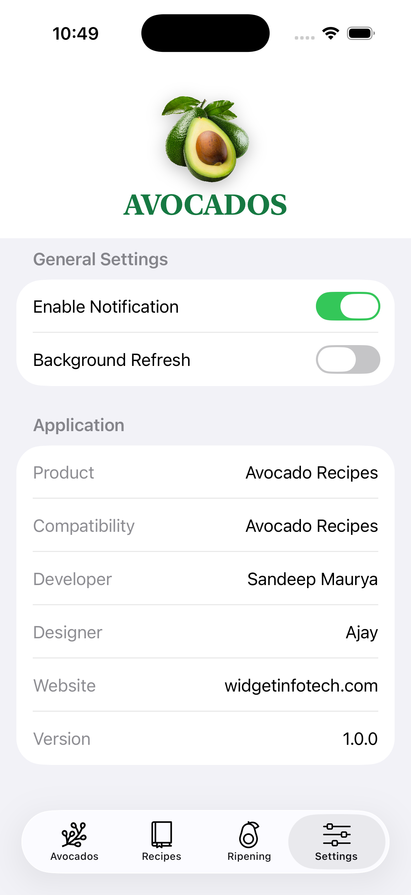

# 🥑 Avocado Recipes - SwiftUI

A modern recipe application built with **SwiftUI** following the **MVVM architecture**.

The app showcases avocado recipes, nutritional information, ripening stages, and helpful facts through a clean and visually appealing interface. It uses local data models to demonstrate UI development, reusable components, and SwiftUI best practices.

---

## 📱 Screenshots

| Home | Dishes | Recipes |
|------|--------| --------|
|  |  |  |

| Recipe Details | Ripening Guide | Settings |
|---------------|----------------| ----------|
|  |  |  |


---

# ✨ Features

- 🥑 Beautiful onboarding experience
- 📖 Browse avocado recipes
- 🍽 Detailed recipe information
- ⭐ Recipe ratings
- 🧾 Ingredients & cooking instructions
- 🥗 Nutritional facts
- 🥑 Avocado ripening guide
- 📚 Informative avocado facts
- ⚙️ Settings screen
- 📱 Custom Tab Navigation
- 🎨 Modern SwiftUI interface
- ♻️ Reusable UI components

---

# 🛠 Technologies

- Swift 5
- SwiftUI
- MVVM Architecture
- Local Data Models
- SF Symbols
- Xcode

---

# 📂 Project Structure

```
AvocadoRecipes
│
├── App
│   ├── AvocadoRecipesApp.swift
│   └── ContentView.swift
│
├── Models
│   ├── Recipe.swift
│   ├── Fact.swift
│   ├── Header.swift
│   ├── Ripening.swift
│   └── Settings.swift
│
├── ViewModels
│   ├── RecipeViewModel.swift
│   ├── FactViewModel.swift
│   └── RipeningViewModel.swift
│
├── Views
│   ├── HomeView.swift
│   ├── RecipeListView.swift
│   ├── RecipeDetailView.swift
│   ├── RipeningView.swift
│   ├── SettingsView.swift
│   └── Components
│
├── Resources
│
└── Assets
```

---

# 🚀 Features Overview

### 🥑 Home

- Introduction to avocados
- Nutritional highlights
- Categories
- Informative cards

---

### 🍽 Recipes

Browse recipes with:

- Large food images
- Ratings
- Preparation time
- Servings
- Cooking time

---

### 📖 Recipe Details

Each recipe includes:

- Hero image
- Rating
- Ingredients
- Step-by-step instructions
- Cooking information

---

### 🥑 Ripening Guide

Learn the different ripening stages including:

- Hard
- Almost Ripe
- Ready to Eat
- Overripe

---

### ⚙️ Settings

Application preferences including:

- Notifications
- Background Refresh
- App Information
- Version Details

---

# 📚 Architecture

This project follows the **MVVM (Model–View–ViewModel)** architecture.

### Model

Contains the application's local data structures such as:

- Recipes
- Facts
- Ripening Stages
- Settings

### View

Responsible for rendering the user interface using SwiftUI.

### ViewModel

Acts as the bridge between the views and the local data models, preparing data for presentation while keeping the UI clean and maintainable.

---

# 💾 Data Source

This application uses **hardcoded local data**.

No backend services or APIs are required.

Data includes:

- Recipe information
- Ingredients
- Instructions
- Nutritional facts
- Ripening stages
- Application settings

---

# 📚 What I Learned

While building this project, I gained practical experience with:

- SwiftUI
- MVVM Architecture
- NavigationStack
- TabView
- ScrollView
- LazyVStack
- Custom Components
- State Management
- Local Data Modeling
- Reusable Views
- Custom Styling
- Modern iOS UI Design

---

# ▶️ Getting Started

### Requirements

- Xcode 15+
- iOS 17+
- Swift 5.9+

### Installation

```bash
git clone https://github.com/sandeep9607/avocado-swiftui.git
```

Open the project in Xcode and run it on an iOS Simulator or a physical device.

---

# 📦 Project Highlights

- Built entirely with SwiftUI
- MVVM architecture
- Clean project organization
- Component-based design
- Reusable UI components
- Local data models
- Easy to extend with API integration

---

# 🔮 Future Improvements

- REST API integration
- Favorite recipes
- Search functionality
- Categories & filters
- SwiftData persistence
- Dark Mode
- Localization
- Unit Tests
- Recipe sharing
- Shopping list generation

---

# 👨‍💻 Author

**Sandeep Maurya**

Senior iOS Engineer

- Swift
- SwiftUI
- UIKit
- Combine
- Swift Concurrency
- Clean Architecture

If you found this project useful, consider giving it a ⭐.
